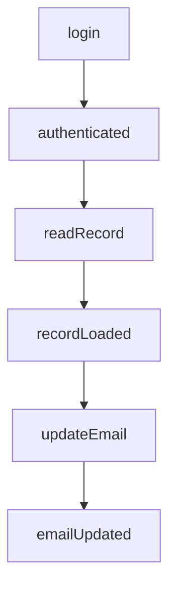
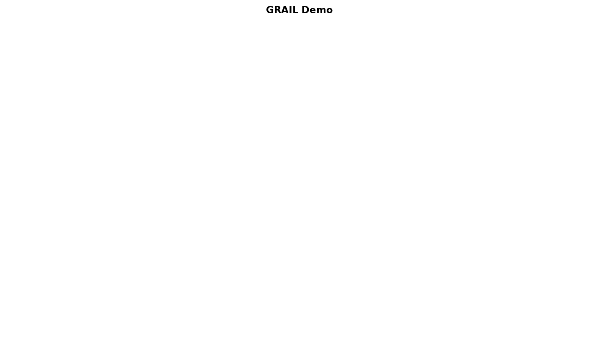

# GRAIL Demo: Goal-Seeking Agents with Recursive Affordance Logic

This demo illustrates the GRAIL model:  
**Goal-seeking via Recursive Affordance-based Interaction Logic.**

It shows how an autonomous client agent can start with a high-level goal (like updating a user’s email), and dynamically discover the necessary steps through interaction — without knowing the plan in advance.

---

## What Is GRAIL?

GRAIL is a model where agents pursue goals by:

1. Attempting a desired action.
2. Detecting what’s missing if the action fails.
3. Recursively pursuing gap-filling affordances.
4. Retrying the original goal once gaps are closed.

This enables agents to navigate uncertainty with minimal logic — using feedback from the environment, not hardcoded plans.

---

## Demo Breakdown

This project demonstrates a GRAIL-style client/server system using local JavaScript classes and modules.

### Core Concepts

| Concept             | Description |
|---------------------|-------------|
| Affordance          | A unit of action with preconditions, inputs, and effects. |
| World State         | The current status of key conditions in the environment. |
| Server              | Evaluates affordances, blocks on missing preconditions, and reveals what’s needed next. |
| Client              | Maintains a pursuit stack and recursively works toward its goal by interpreting server feedback. |

---

## File Overview

| File | Purpose |
|------|---------|
| `run.js`             | Entry point. Instantiates world, server, and client. Starts the pursuit loop. |
| `client.js`          | Implements the GRAIL pursuit logic using a LIFO stack. |
| `server.js`          | Processes affordances and maps unmet preconditions to next-step affordances. |
| `affordanceModel.js` | Defines the `Affordance` class. |
| `affordanceRegistry.js` | Defines three affordances: `updateEmail`, `readRecord`, `login`. |
| `worldState.js`      | Maintains mutable world conditions and applies effects. |

---

## What the Demo Does

The client is told:  
“Update the user’s email address.”

It tries to do that by invoking `updateEmail`. But the system blocks the action due to unmet preconditions. The flow looks like this:

```
1. Try: updateEmail()
   Blocked: requires recordLoaded
   → Try: readRecord()
     Blocked: requires authenticated
     → Try: login()
       Success → apply effect: authenticated
     Success: readRecord() → apply effect: recordLoaded
   Success: updateEmail() → apply effect: emailUpdated
```

Each time the client is blocked, the server returns the next needed affordance.  
The client pushes it onto a stack and continues — retrying earlier goals once conditions are met.

---

## What the Workflow Looks Like

The workflow to complete a task looks pretty simple in this demo



## What a Running Demo Run Looks Like

Here's an animated GIF that shows how the GRAIL client works. Once given a goal state (`emailUpdated`) the GRAIL client immediately attempts the related affordance. If the result is `BLOCKED`, the client scans for unmet conditions (new affordances) and executes the next availble affordance. This process of attemtping and responding to blocked attempts evenutally results in a completed task.



---

## To Run the Demo

Ensure you’re using a Node.js environment that supports ES modules (e.g. Node 16+ with `"type": "module"` in package.json).

```bash
node run.js
```

You’ll see log output showing:

- Pursuit stack operations
- Server-side precondition checks
- Effects applied to world state

---

## Key Takeaways

- Agents don’t need plans — they need a safe way to fail and recover.
- The environment participates by revealing affordances tied to unmet conditions.
- GRAIL enables goal-seeking behavior with minimal agent intelligence, suitable for agentic API clients, robotics, and adaptive workflows.

---
